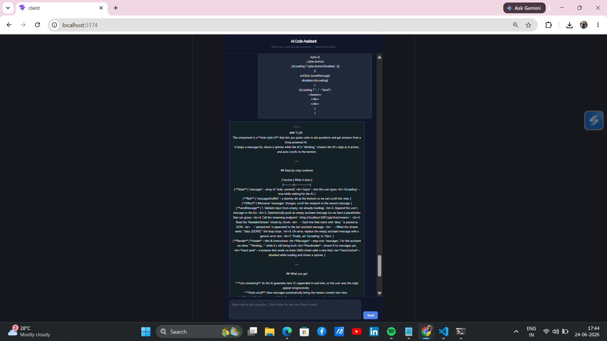
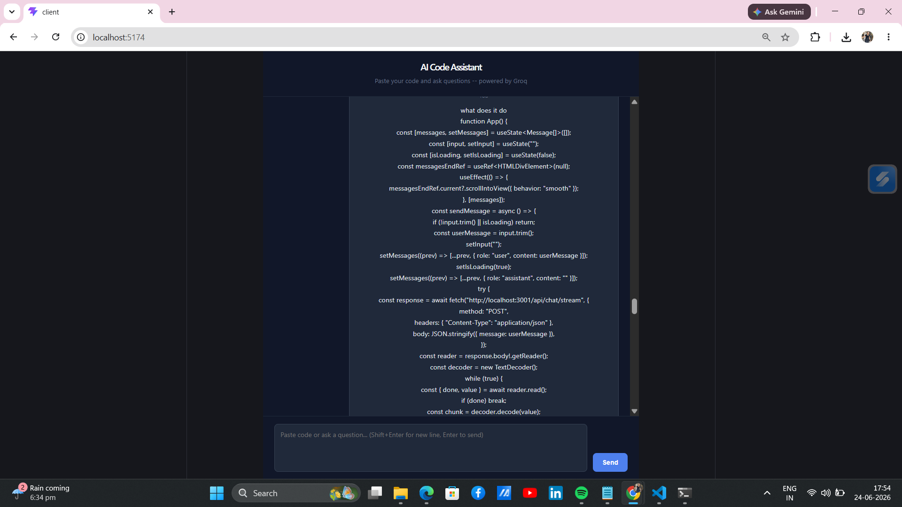

# AI Code Chat -- Streaming Assistant

Full-stack AI chat interface for asking questions about code.
Responses stream in real time using Groq's API.

## Tech Stack
- Frontend: React + TypeScript (Vite)
- Backend: Node.js + Express
- AI: Groq API (openai/gpt-oss-20b) with streaming
- Streaming: Server-Sent Events (SSE)

## Features
- Real-time streaming responses, token by token, at very low latency
- Code-focused AI tuned for technical questions
- Clean dark UI optimised for reading code explanations
- Enter to send, Shift+Enter for new line

## How Streaming Works
The Node.js backend calls Groq's chat completions endpoint with
`stream: true` and forwards each chunk via Server-Sent Events. The
React frontend reads the stream with a ReadableStream reader and
appends each token to the message in state -- the same approach
used by ChatGPT and similar AI products.

## Why Groq
Groq runs inference on custom LPU hardware instead of GPUs, giving
noticeably lower time-to-first-token and higher tokens/second than
most hosted LLM APIs -- a good fit for a chat UI where perceived
responsiveness matters.

## Setup
1. Clone the repo
2. Get a free Groq API key at console.groq.com
3. Add to server/.env: GROQ_API_KEY=your_key_here
4. cd server && npm install && node index.js
5. cd client && npm install && npm run dev
6. Visit http://localhost:5173

## Screenshots

